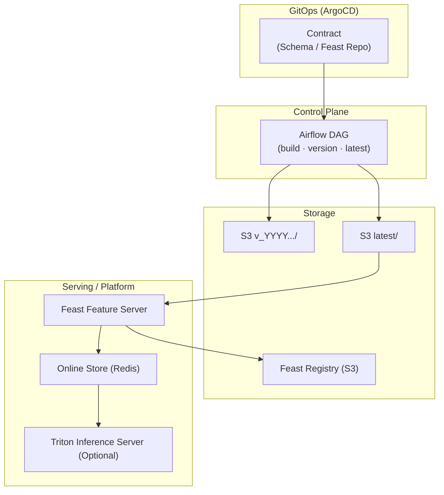
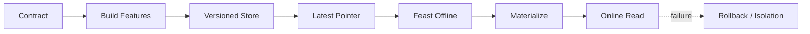

# 🚀 Feature Store & Feast Platform

### GitOps · Explicit Control · Operational Reproducibility

> “Feature Store는 피처를 만드는 도구가 아니라,
ML 시스템이 ‘같은 결과를 다시 낼 수 있는지’를 보장하는 운영 기준이다.”
> 

이 리포지토리는

**Feature Store-lite → Feast → (확장) Triton Serving**까지 이어지는

**운영 중심 MLOps 플랫폼 설계와 구현**을 담고 있습니다.

모든 구성은 다음 원칙을 따릅니다.

- 계약(Contract)은 코드가 아니라 **운영 리소스**
- 자동화보다 먼저 **통제 가능한 상태 전이**
- dev/prod 완전 분리
- 실패는 삭제하지 않고 **재현·격리·복구**

---

## 🎯 What this repository proves

- Feature Store를 **운영 재현성의 기준점**으로 정의
- GitOps 기반으로 **계약(Schema / Repo)을 먼저 고정**
- Airflow를 **Control Plane**으로 사용해 생성/저장 규칙을 통제
- S3에 **version + latest** 저장 정책으로 재현성과 운영 편의 동시 확보
- Feast를 얹어 **Offline / Online / Registry까지 조회 가능한 플랫폼 완성**
- (확장) Triton으로 **Explicit model control 기반 서빙 플랫폼** 연결 가능

---

## 🧩 End-to-End Architecture



---

## 🔁 Core Operational Flow



**핵심 포인트**

- Contract가 먼저 고정됨
- 파이프라인은 Contract를 **읽기만 하는 소비자**
- 재현은 version으로, 운영은 latest로
- Online/Serving은 Offline과 **동일한 계약을 공유**

---

## 📁 Repository Structure (Logical View)

```bash
.
├── feature-store-lite/
│   ├── gitops/# schema / metadata ConfigMap
│   ├── airflow/# build → version → store
│   └── s3-layout/# versioned storage structure
│
├── feast/
│   ├── charts/# Feast + Redis Helm chart
│   ├── apps/# ArgoCD Applications
│   └── repo/# feature_store.yaml / repo.py
│
├── triton/# (Optional) Serving Platform
│   ├── charts/# Triton explicit mode
│   ├── apps/# ArgoCD Applications
│   └── ops/# shared storage (Airflow ↔ Triton)
│
└── docs/
    ├── proof/# E2E Proof screenshots
    └── diagrams/# Architecture / Flow diagrams

```

---

## 🧠 Design Principles (Why this works)

### 1️⃣ Contract First

- schema / repo는 **운영 리소스**
- GitOps로 배포·롤백 가능
- 코드 수정 없이 계약 변경 가능

### 2️⃣ Version is a Rule, not a Path

- `/<feature_set>/<version>/` **1단 고정**
- depth로 재현성을 만들지 않음

### 3️⃣ latest is an Operational Pointer

- Feast offline은 latest만 사용
- 분석/학습/디버깅은 언제든 version으로 회귀

### 4️⃣ Explicit Control over Automation

- Feast materialize / Triton model load는 **명시적 실행**
- 자동 로딩/자동 반영 ❌
- 검증을 통과한 경우에만 상태 전이

### 5️⃣ Failure is Isolated, not Deleted

- 실패한 산출물/모델은 제거하지 않음
- 격리(.failed / rollback) → 재현 가능
- 운영 시스템은 **실패 이력을 품을수록 강해짐**

---

## 📊 Observability & Proof

- **ArgoCD**: dev/prod Synced & Healthy
- **Airflow**: DAG E2E 성공 (build → store)
- **S3**: version + latest 동시 존재
- **Metadata**: schema_hash / generated_at / source 기록
- **Feast**:
    - apply → registry 반영
    - materialize → Redis 적재
    - online 조회 결과 실값 확인
- **(Optional) Triton**:
    - explicit load
    - rollback without redeploy
    - latency / error 기반 알럿
