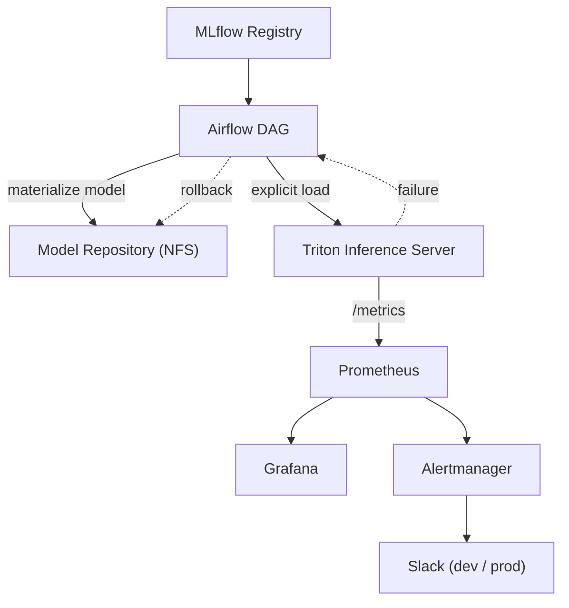
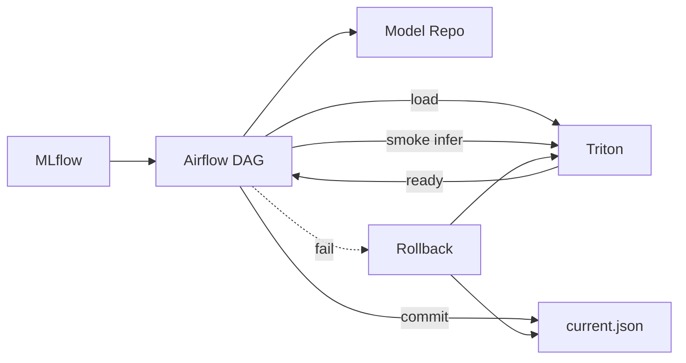

# 🚀 Triton Serving Platform – GitOps · Explicit Control · Alerting

> “모델 서빙을 ‘배포 이벤트’가 아니라 ‘검증된 상태 전이’로 운영한다.”
> 

이 디렉터리는 **Triton Inference Server를 GitOps 기반 운영형 서빙 플랫폼**으로 구성한 구현입니다.

모델은 **자동 로딩되지 않으며**, 검증 체인을 통과한 경우에만 **explicit load**로 운영에 반영됩니다.

---

## 🎯 What this Triton setup proves

- Triton을 **항상 떠 있는 Serving Plane**으로 유지
- 모델 변경은 **재배포 없이 explicit load/unload**로만 제어
- **MLflow → Airflow → Triton** 단일 배포 체인
- dev/prod 완전 분리 (namespace / storage / rules / alerts)
- **모델 실행 관점(latency/error)** 기준의 운영 알럿

---

## 🧩 Architecture Overview



---

## ⚙️ Core Design Principles

### 1. Explicit Model Control

- `model-control-mode=explicit`
- 모델 디렉터리가 생겨도 **자동 로딩 ❌**
- 운영 반영 조건:
    1. materialize 성공
    2. load 성공
    3. ready 확인
    4. smoke inference 통과
    5. `current.json` commit

---

### 2. Single Source of Truth

- `current.json` = **운영 중인 모델의 단일 기준**
- 실패한 모델은 삭제하지 않고:
    - `.failed_<version>` 으로 격리
    - 재현 / 원인 분석 가능

---

### 3. GitOps First

- Triton 자체는 GitOps로 **항상 running**
- 모델 변경은 GitOps가 아니라 **Control Plane(Airflow)** 에서 수행
- 배포와 서빙의 책임을 분리

---

## 📂 Repository Structure (Triton)

```bash
charts/triton/
├── Chart.yaml
├── templates/
│   ├── deployment.yaml# Triton Deployment (explicit mode)
│   ├── service.yaml# ClusterIP
│   └── serviceMonitor.yaml# Prometheus scrape
└── values/
    ├── base.yaml# 공통 설정
    ├── dev.yaml# dev 리소스/옵션
    └── prod.yaml# prod 리소스/옵션

```

```bash
apps/
├── triton-dev.yaml# ArgoCD Application (dev)
└── triton-prod.yaml# ArgoCD Application (prod)

```

```bash
ops/storage/triton/
├── dev/
│   ├── pv-pvc.yaml# Triton model-repo
│   └── pv-pvc-airflow.yaml# Airflow → Triton 공유
└── prod/
    ├── pv-pvc.yaml
    └── pv-pvc-airflow.yaml

```

---

## 🔁 Operational Flow (Model Lifecycle)



---

## 📊 Observability & Alerting

### Metrics (Prometheus)

- `nv_inference_count`
- `nv_inference_request_success`
- `nv_inference_request_failure`
- `nv_inference_request_duration_us`

> Triton 기본 latency 메트릭은 histogram이 아니므로
> 
> 
> **p95 대신 mean latency 기반** 운영 알럿을 사용합니다.
> 

---

### Alerts (PrometheusRule)

- **High Mean Latency**
- **High Error Rate**
- dev/prod namespace 기준 완전 분리
- Alertmanager **null default** + regex routing

---

### Dashboards (Grafana)

- RPS (success / failure)
- Mean latency (ms)
- Queue delay
- Pending requests
- Pod health

> 알럿 이후 30초 내 판단을 목표로 설계됨
> 

---

## 🧠 Operational Rules (TL;DR)

| Category | Rule |
| --- | --- |
| Load Control | explicit only |
| Rollback | DAG 기반, 재배포 없음 |
| Storage | dev/prod path 분리 |
| Metrics | model execution 기준 |
| Alerts | namespace regex routing |
| GitOps | infra only, model 제외 |

---

## 🌱 Future Expansion

- GPU 기반 Triton (TensorRT / ONNX Runtime)
- Gateway 계층(Nginx/Envoy) + HTTP error 알럿 분리
- Canary / Shadow traffic
- Triton gRPC 기반 서빙
- ScyllaDB 기반 low-latency feature serving

---

## 🏁 Summary

> 이 Triton 구성의 핵심은
> 
> 
> “서빙을 자동화했다”가 아니라
> 
> “서빙을 통제 가능한 상태 전이로 만들었다”는 점입니다.
> 

모델은 언제든 교체할 수 있지만,

**운영 반영은 오직 검증을 통과한 경우에만** 일어납니다.
