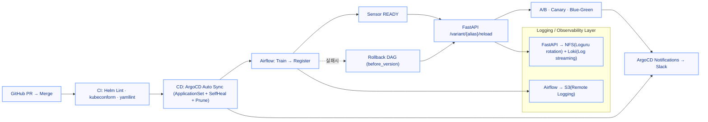

# 🧱 MLOps Infrastructure – One Commit Flow

> “Git 커밋 한 번으로 학습 → 등록 → 배포 → 실험 → 관제까지 자동 순환하는 MLOps 플랫폼.”
> 

---

## 📘 Overview

이 프로젝트는 **Helm 기반 MLOps 인프라**를

**GitOps(ArgoCD)** 중심으로 재설계하여

모델 실험부터 배포, 관제, 보안까지 **완전 자동화된 루프**를 구축한 사례입니다.

- **Helm 템플릿 재사용 + GitOps 자동화 계층**
- **Airflow · MLflow · FastAPI 3축 연동**
- **SealedSecret · cert-manager · Application 기반 운영**
- **내부망에서도 완전 자동화 가능한 MLOps 루프**
- **kube-prometheus-stack + Loki/Promtail 기반 dev/prod Observability 스택**
- **S3 → Airflow → Python 전처리 → Feature S3 저장 엔드투엔드 Data Pipeline**

---

## 🧩 Architecture

### Core Components

| Layer | Stack | Description |
| --- | --- | --- |
| **Orchestration** | Airflow (KubernetesExecutor) | 모델 학습, 등록, 롤백, Slack 알림 |
| **Experiment Tracking** | MLflow Tracking + Registry | 실험·모델 버전 관리 (S3 + PostgreSQL) |
| **Serving** | FastAPI (A/B · Canary · Blue-Green) | MLflow 모델 자동 로드 + 실험형 서빙 |
| **CI/CD** | GitHub Actions + ArgoCD | Helm Lint → Auto Sync → Slack 통합 알림 |
| **Security** | SealedSecret + Rotation/Re-Seal | AWS 키 자동 회전 및 컨트롤러 키 재암호화 |
| **TLS** | cert-manager (내부 CA) | 외부 노출 없이 자동 갱신되는 TLS 체계 |
| **Storage** | NFS (내부) + S3 (외부) | 로그 이원화 및 장기 보관 구조 |
| **Monitoring (Metrics)** | kube-prometheus-stack | monitoring-dev/prod 분리, ServiceMonitor·Rule 기반 메트릭 수집 |
| **Observability (Logs/Dashboards)** | Loki · Promtail · Grafana | 로그 수집 + 공용 대시보드(RPS/지연/에러율/노드 상태) |
| **Data Pipeline** | Airflow DAG + S3 + Python(csv) | S3 Raw → DAG 처리 → Feature 생성/저장 |
| **Alerting/Notifications** | Alertmanager · Slack · ArgoCD Noti | 알람·배포 이벤트 Slack 통합 |

---

## ⚙️ System Flow

### One Commit Flow



> PR → CI → CD → Slack → 실험까지,
> 
> 
> Prometheus/Grafana/Loki가 전체 플로우를 관측하는 **완전 자동화 파이프라인**
> 

---

## 🔐 Key Features

### 1. GitOps 기반 배포 자동화

- Helm values 그대로 유지 (`charts/<app>/values/{base,dev,prod}.yaml`)
- ArgoCD **Application** 으로 dev/prod 각각 관리
- **SelfHeal + Prune** 으로 OutOfSync 상태를 자동 복원

### 2. 보안 자동화

- `ops/rotate/rotate-aws-credentials.sh` : IAM Access Key 자동 회전
- `ops/seal/re-seal.sh` : SealedSecret 컨트롤러 키 교체 대비 재암호화
- GitOps 내에서 Secrets를 코드로 관리하는 **“Secrets as Code”** 패턴 구현

### 3. 로그 관리

- **Airflow → S3 Remote Logging** 으로 장기 보관
- **FastAPI → NFS(Loguru rotation/retention)** 으로 애플리케이션 로그 관리
- Loki/Promtail로 FastAPI·플랫폼 로그 중앙 집계, 내부망/외부망 이원화로 보안·가시성 균형 유지

### 4. TLS 관리

- `cert-manager` 내부 CA 기반 자동 발급/갱신
- 외부 DNS/CA 없이 **폐쇄망에서도 완전 자동화** 가능
- `/etc/hosts` 기반 신뢰망 구성으로 공격 표면 최소화

### 5. Observability 스택 (dev/prod 분리)

- `apps/monitoring-dev.yaml`, `apps/monitoring-prod.yaml` 으로
    
    kube-prometheus-stack 65.5.0을 dev/prod에 각각 배포
    
- `envs/{dev,prod}/monitoring/*` 에 ServiceMonitor/PodMonitor/Rules 정의,
    
    라벨 `release=monitoring-{env}` 기준으로 메트릭·알람 완전 분리
    
- `envs/{dev,prod}/observability/*` + `ops/storage/{monitoring,observability}` 로
    
    Prometheus/Loki 스토리지(NFS) 및 로그 파이프라인 구조를 표준화
    

### 6. Grafana Dashboards

- FastAPI용 **Service Overview** 대시보드로 RPS·에러율(5xx)·p95 지연·인스턴스 수·자원 사용량·알람·로그를 한 화면에서 관제
- Platform용 **Kubernetes & Nodes** 대시보드로 클러스터/노드 자원, 네임스페이스별 Pod 상태, CrashLoopBackOff 이상 징후를 추적
- Dashboard JSON을 그대로 Import하여 dev/prod 양쪽에서 재사용 (데이터소스 변수 `DS_PROM`, `DS_LOKI` 만 선택)

### 7. Data Pipeline (S3 → Airflow → Feature S3)

- 별도 Airflow DAG 리포지토리(`airflow-dags-dev/`)에서
    
    Raw S3 CSV → 검증 → Feature 생성 → Feature S3 저장까지 일 단위 파이프라인 운영
    
- `extract_raw_data → validate_data → build_features → store_features → summarize_run`
    
    순서로 구성하고, `build_features()` 에서 숫자 컬럼 자동 탐색 및 `row_sum` feature 생성
    
- Python `csv` 모듈 기반의 경량 ETL 구조라,
    
    스키마와 S3 경로만 바꾸면 어떤 기업용 데이터 레이크에도 쉽게 이식 가능
    

---

## 🧠 Operational Principles

| Category | Principle |
| --- | --- |
| **보안/시크릿** | Rotation/Re-Seal 자동화, ReEncrypt 방식으로 안전한 갱신 |
| **배포 안정성** | Sensor READY 후 Reload, 실패 시 DAG 기반 롤백으로 트래픽 영향 최소화 |
| **로그 체계** | Airflow=S3 / FastAPI=NFS + Loki, 권한 및 보관 주기 표준화 |
| **TLS 신뢰망** | cert-manager 내부 CA, 외부 의존 없는 자동 갱신 |
| **관제 일원화** | Prometheus/Alertmanager + Grafana + Slack = 단일 관제 채널 |
| **GitOps 복원력** | SelfHeal + Prune으로 OutOfSync 즉시 복원 |
| **env 분리 원칙** | `monitoring-dev` / `monitoring-prod` 네임스페이스 
+ `release=monitoring-{env}` 라벨로 메트릭·알람·스토리지까지 전면 분리 |
| **데이터 파이프라인** | S3 경로·스키마·Feature 정의를 코드로 관리하여 재현 가능성과 이식성 확보 |

---

## 🌱 Future Expansion

| 목표 | 내용 |
| --- | --- |
| **Kubeflow** | Airflow → Kubeflow Pipelines Trigger → MLflow 등록 → FastAPI 반영 |
| **Triton Inference Server** | FastAPI → gRPC → Triton → GPU 서빙 표준화 |
| **ScyllaDB** | 초저지연 Feature/로그 저장소, 피드백 루프 완성 |
| **LLMOps** | 대규모 모델·프롬프트 버전 관리 + 실험 자동화 |
| **Data Pipeline 고도화** | 현재 CSV 기반 파이프라인을 Parquet/Feature Store(예: Feast)로 확장 |

---

## 🧾 Repository Structure

```bash
mlops-infra/
├── apps/                         # ArgoCD Application 정의
│   ├── monitoring-dev.yaml       # kube-prometheus-stack(dev)
│   ├── monitoring-prod.yaml      # kube-prometheus-stack(prod)
│   ├── appset-loki.yaml          # Loki(dev/prod) ApplicationSet
│   ├── appset-promtail.yaml      # Promtail(dev/prod) ApplicationSet
│   ├── dev-namespaces.yaml       # dev 네임스페이스 생성
│   ├── prod-namespaces.yaml      # prod 네임스페이스 생성
│   ├── project-dev.yaml          # ArgoCD Project(dev)
│   └── project-prod.yaml         # ArgoCD Project(prod)
├── bootstrap/                    # 최초 부트스트랩 스크립트·매니페스트
│   ├── 00-argocd-helm-install.sh # ArgoCD Helm 설치 스크립트
│   ├── 10-argocd-ingress.yaml    # ArgoCD Ingress
│   ├── argocd/                   # ArgoCD values
│   ├── metallb/                  # MetalLB IP 풀
│   └── notifications/            # ArgoCD Notifications 설정
├── charts/                       # 애플리케이션 Helm Charts
│   ├── airflow/
│   │   ├── templates/            # Ingress 등 커스텀 템플릿
│   │   └── values/               # base/dev/prod values
│   ├── fastapi/
│   │   ├── app/                  # FastAPI A/B·Canary·Blue-Green 서빙 코드
│   │   ├── templates/            # Deployment/Service/Ingress/ServiceMonitor
│   │   └── values/               # base/dev/prod values
│   └── mlflow/
│       ├── templates/            # Deployment/Service/Ingress
│       └── values/               # base/dev/prod values
├── envs/                         # 환경별(manifest + SealedSecret) 설정
│   ├── dev/
│   │   ├── certificates/         # dev용 TLS Issuer/Certificate
│   │   ├── monitoring/           # FastAPI ServiceMonitor/PodMonitor/Rules
│   │   ├── observability/        # Loki/Promtail values(dev)
│   │   ├── sealed-secrets/       # Airflow/FastAPI/MLflow/Monitoring SealedSecrets
│   │   └── namespaces.yaml       # dev 공통 네임스페이스
│   └── prod/
│       ├── certificates/
│       ├── monitoring/           # prod용 ServiceMonitor/Rules
│       ├── observability/        # Loki/Promtail values(prod)
│       ├── sealed-secrets/
│       └── namespaces.yaml
├── ops/                          # 운영용 스크립트/스토리지 정의
│   ├── rotate/                   # AWS Credentials rotation
│   ├── seal/                     # SealedSecrets 재암호화 스크립트
│   └── storage/                  # fastapi-logs/monitoring/observability PV/PVC
└── README.md
```

---

## 🧰 Tech Stack Summary

| Category | Stack |
| --- | --- |
| **IaC / Deployment** | Helm · ArgoCD · MetalLB · SealedSecrets |
| **ML Orchestration** | Airflow · MLflow · FastAPI |
| **Storage** | AWS S3 · NFS (PV/PVC) · PostgreSQL |
| **Security** | cert-manager (Internal CA) · SealedSecret Rotation/Re-Seal |
| **CI/CD** | GitHub Actions + ArgoCD Auto Sync |
| **Monitoring** | kube-prometheus-stack (Prometheus · Alertmanager · Grafana) |
| **Logging / Tracing** | Loki · Promtail · FastAPI(Loguru) · Airflow Remote Logging |
| **Alerting** | Alertmanager Slack Webhook · ArgoCD Notifications |
| **Data Pipeline** | Airflow PythonOperator · S3 · csv 기반 ETL/Feature Engineering |
| **Languages** | Python · Bash · YAML |
